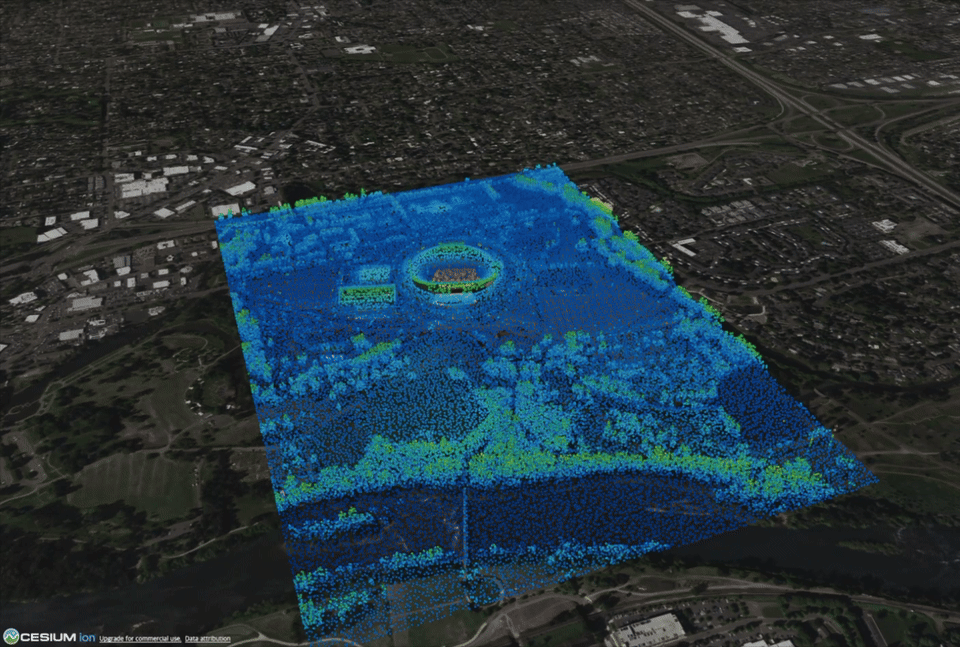
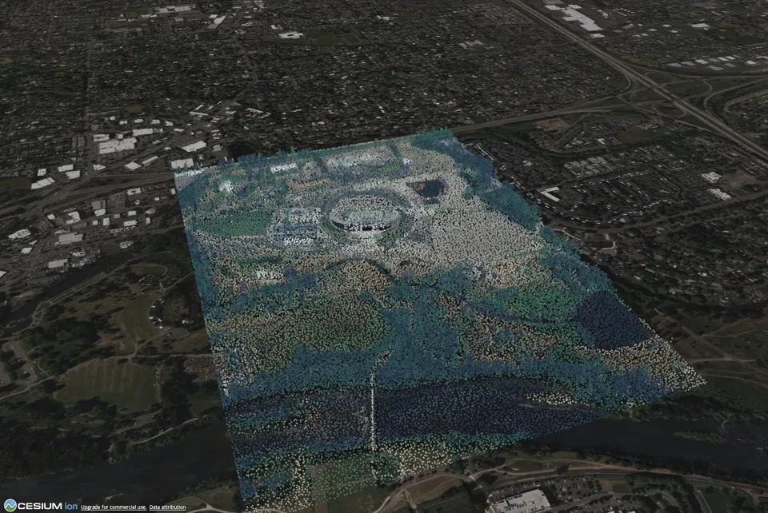
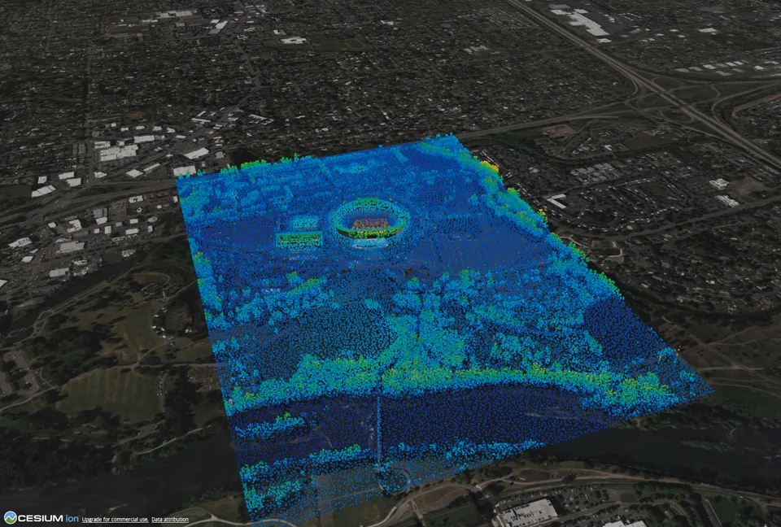
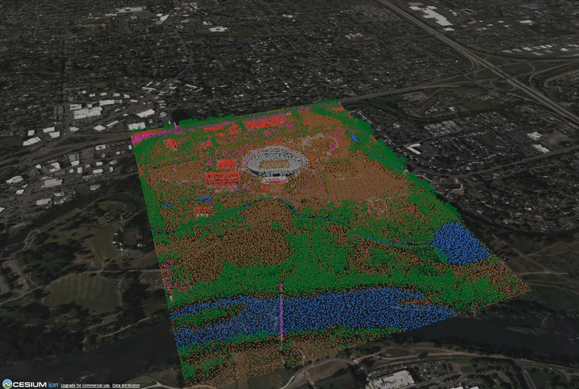
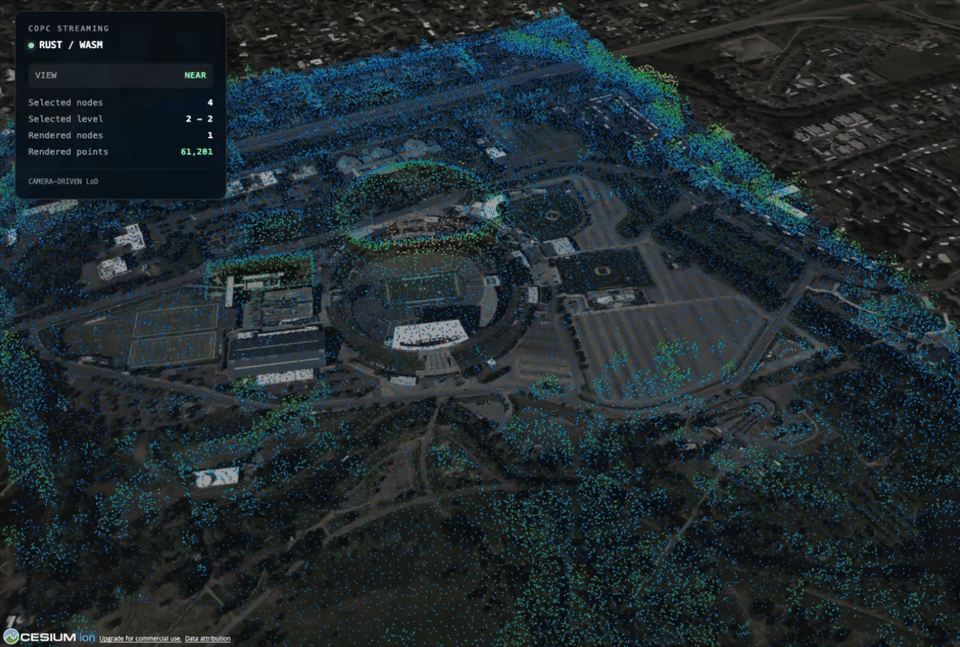

# COPC Adapter

Stream and visualize Cloud Optimized Point Cloud (COPC) data directly in
CesiumJS without preprocessing or converting it to Cesium-specific tiles.

COPC Adapter reads the original COPC resource in the browser, uses HTTP Range
requests to load the hierarchy and selected point chunks, and renders them in
CesiumJS. The application keeps ownership of its own `Cesium.Viewer`.



The repository-owned captures use the local Autzen Stadium sample
(`/samples/autzen.copc.laz`) rendered in CesiumJS with the demo's `rgb` color
mode. The streaming capture shows the same dataset while camera movement
changes the distance/bounds-based LoD; the static styling examples below also
include the `elevation` and `classification` modes.

## Why COPC Adapter

Many point-cloud workflows look like this:

```text
Point cloud -> preprocessing -> tiling/conversion -> hosting -> visualization
```

COPC Adapter keeps the original COPC resource as the source for both storage
and visualization:

```text
COPC -> HTTP Range requests -> hierarchy / LoD -> point chunks -> CesiumJS
```

It is a focused browser-side path for applications that want to stream COPC
data without a separate conversion step.

## Features

- Direct COPC streaming from a browser-readable URL
- HTTP Range random access and recursive hierarchy traversal
- Camera-driven distance/bounds-based LoD selection
- Progressive refinement with bounded streaming work
- CesiumJS rendering through a caller-owned `Viewer`
- Stable `copc-js` backend and opt-in Rust/WASM backend
- Fixed, RGB, elevation, intensity, and classification styling
- Typed TypeScript API and explicit layer lifecycle
- Packed npm artifact with declarations and decoder runtime assets

## Quick Start

Install the package and the Cesium version owned by your application:

```bash
npm install @frillab/copc-adapter cesium
```

```ts
import * as Cesium from 'cesium';
import { CopcCesiumLayer } from '@frillab/copc-adapter';

const viewer = new Cesium.Viewer('cesium-container');
const layer = new CopcCesiumLayer({
  url: 'https://example.com/data.copc.laz',
  colorMode: 'elevation',
});

await layer.load();
layer.attachTo(viewer);
```

The caller owns the Cesium `Viewer` and is responsible for destroying it.
Destroying the layer does not destroy the viewer:

```ts
layer.detachFrom();
layer.destroy();
viewer.destroy();
```

The decoded point cache is bounded by `maxPointCacheBytes` (256 MiB by
default), in addition to its node-count safety cap. Its diagnostics count the
actual `TypedArray.byteLength` values for cached project-owned coordinates and
attributes. They represent decoded CPU point-buffer memory, not exact browser,
Cesium, or GPU memory:

```ts
console.log(layer.getPointCacheDiagnostics());
```

The COPC source must support HTTP Range requests. Cross-origin sources also
need CORS headers that allow the consuming origin and expose the range
response metadata used by the reader.

## Rust / WASM Backend

`copc-js` is the stable default backend. Rust/WASM is opt-in and experimental:

```ts
const layer = new CopcCesiumLayer({
  url: 'https://example.com/data.copc.laz',
  backend: 'rust',
});
```

Both backends use the same public layer, streaming, coordinate, and Cesium
rendering path. Rust/WASM does not create or own the Cesium viewer. It is not
presented as universally faster; in the tested Autzen scenario, coordinate
transformation was a larger cost than Rust point decoding.

## Styling Modes

<table>
  <thead>
    <tr>
      <th>RGB</th>
      <th>Elevation</th>
      <th>Classification</th>
    </tr>
  </thead>
  <tbody>
    <tr>
      <td></td>
      <td></td>
      <td></td>
    </tr>
    <tr>
      <td><code>colorMode: 'rgb'</code></td>
      <td><code>colorMode: 'elevation'</code></td>
      <td><code>colorMode: 'classification'</code></td>
    </tr>
  </tbody>
</table>

The supported modes are:

- `fixed`: stable cyan fallback color
- `rgb`: source RGB channels
- `elevation`: transformed dataset height range
- `intensity`: normalized intensity range
- `classification`: categorical classification palette

Attribute-based modes fall back to the fixed color when the required source
attribute is unavailable.

## Camera-Driven LoD and Streaming



Camera movement changes hierarchy selection. Coarse nodes provide useful
coverage while higher-detail nodes are loaded, decoded, prepared, and
rendered in bounded progressive batches. Ready finer nodes replace their
coarse ancestors; a coarse node remains visible while its replacement is
pending.

Streaming updates yield between batches and invalidate stale asynchronous work
after a newer camera update. The selector uses a viewport-aware projected-error
policy. For a visible node, it estimates `SSE = geometricErrorMeters *
viewportHeightPixels / (2 * distanceMeters * tan(verticalFovRadians / 2))` and
refines while the result exceeds `streaming.maxScreenSpaceError` (default `8`
pixels). The adapter's geometric scale is `max(rootSpacing / 2^level,
nodeExtent / 2)` in metres: COPC defines root spacing as the space between
points at level zero and halves it at each octree level; the extent term is a
conservative proxy for unresolved geometry when no per-node error metadata
exists. Frustum culling is applied before this decision.

## Architecture

```text
COPC URL
  ↓
HTTP Range source
  ↓
CopcBackend
  ├─ copc-js
  └─ Rust/WASM
  ↓
COPC metadata / hierarchy / point buffers
  ↓
CRS transform → WGS84
  ↓
NodeSelector / StreamingManager
  ↓
CopcPointRenderer
  ↓
PointPrimitiveRenderer → Cesium PointPrimitiveCollection
```

The backend reads COPC data. The layer coordinates Cesium camera events, LoD,
streaming, rendering, and lifecycle. The application creates and owns the
Cesium `Viewer`. See the [architecture guide](docs/ARCHITECTURE.md) for the
module boundaries.

## Public API and Lifecycle

With a caller-owned `viewer` and a configured `layer`, the lifecycle is:

```ts
import { CopcCesiumLayer } from '@frillab/copc-adapter';

await layer.load();
layer.attachTo(viewer);

layer.detachFrom();
await layer.reload();
layer.unload();
layer.destroy();

const snapshot = layer.getSnapshot();
const metadata = layer.getMetadata();
```

See [API documentation](docs/API.md) for options, backend boundaries, point
fields, errors, and lifecycle details.

## Development

Requirements: Node.js 18 or later and a Rust toolchain with the
`wasm32-unknown-unknown` target.

```bash
rustup target add wasm32-unknown-unknown
npm ci
npm ci --prefix apps/viewer-web
npm run download-samples -- autzen
mkdir -p apps/viewer-web/public/samples
cp samples/local/autzen.copc.laz apps/viewer-web/public/samples/autzen.copc.laz
```

Start the local viewer with:

```bash
npm --prefix apps/viewer-web run dev
```

Core validation commands:

```bash
npm --prefix apps/viewer-web run typecheck
npm --prefix apps/viewer-web run test
npm --prefix apps/viewer-web run coverage
npm --prefix apps/viewer-web run build
npm --prefix apps/viewer-web run test:e2e
npm --prefix apps/viewer-web run benchmark:renderer
npm --prefix apps/viewer-web run benchmark:streaming
npm --prefix apps/viewer-web run test:e2e -- e2e/renderer-performance.spec.ts
npm run test:pack
cargo test --workspace
```

To build and inspect the library artifact:

```bash
cd apps/viewer-web
npm run build:library
npm pack
```

The current npm release is `v0.1.1`. It corrects a packaging issue in `v0.1.0`
where an existing `dist` directory could leave stale files in the published
artifact. Library builds now clean `dist` first, `npm pack` rebuilds through
`prepack`, and sample COPC data is excluded from the package.

`npm run test:pack` is the release-boundary gate for the generated `.tgz`. It
builds Rust/WASM and the library, checks the tarball contents, installs it by
package name into a disposable external Vite + Cesium consumer, builds and
previews that consumer, and runs Chromium against the production bundle. The
consumer verifies HTTP 206/Range traffic, package-local decoder assets,
incremental hierarchy diagnostics, Rust backend selection without fallback,
coordinate/attribute rendering, and continued `copc-js` operation. Its
checked-in template is in `tests/environments/cesium-vite/`; the sample is
staged only into the disposable consumer and is never packaged.

The npm `latest` version and the package metadata are both `0.1.1` for this
corrected release.

## Known Limitations

These are the current v0.1.1 boundaries:

- Hierarchy metadata is fully traversed before point streaming begins.
- LoD uses adapter-owned screen-space error with bounds/frustum filtering and
  depth/node-count safety caps; occlusion culling is not implemented yet.
- Browser Rust/WASM point decode uses a bounded worker pool when `Worker` is
  available; environments without workers use the documented main-thread
  fallback. Worker queue/concurrency diagnostics are exposed in snapshots.
- Rendering uses the compatibility `PointPrimitiveRenderer` boundary backed by
  `Cesium.PointPrimitiveCollection`; benchmark evidence is in the
  [Issue #48 report](docs/benchmarks/issue-48-renderer.md).
- Dense refinement workloads can take time to finish progressively. The
  scheduler yields between bounded batches, stale generations are discarded,
  and rendered-point budget/backpressure keeps active work bounded. See the
  [Issue #68 validation report](docs/benchmarks/issue-68-streaming.md).
- The Rust backend currently targets the supported LAS 1.4 point format
  subset, including point formats 6, 7, and 8.
- Source URLs must support HTTP Range requests and appropriate CORS behavior.

## Roadmap

Follow-up work includes:

- Broader view-aware LOD and hierarchy loading for larger datasets
- Worker-based hierarchy/loading and broader worker observability
- A measured renderer boundary is complete ([#48](https://github.com/mors119/copc-adapter/issues/48)); batched/custom rendering remains follow-up work only if needed
- Occlusion-culling investigation remains deferred pending measured hidden-node
  evidence ([#60](https://github.com/mors119/copc-adapter/issues/60))

See the [project roadmap](docs/ROADMAP.md) and the
[GitHub issue tracker](https://github.com/mors119/copc-adapter/issues) for
scope and status.

## Related Documentation

- [Architecture](docs/ARCHITECTURE.md)
- [API](docs/API.md)
- [Examples](docs/EXAMPLES.md)
- [Roadmap](docs/ROADMAP.md)
- [Sample datasets](samples/README.md)
- [Issue #61 performance work](https://github.com/mors119/copc-adapter/issues/61)
- [Issue #68 streaming validation report](docs/benchmarks/issue-68-streaming.md)

## Community and License

- [Contributing guide](CONTRIBUTING.md)
- [Code of Conduct](CODE_OF_CONDUCT.md)
- [Security policy](SECURITY.md)
- [Support](SUPPORT.md)

COPC Adapter is released under the [Apache License 2.0](LICENSE).
